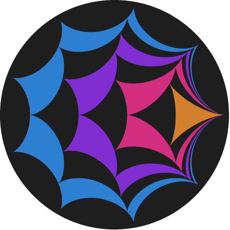

</img>

## Kurt Schneider

<!--### About -->
<ul>
  <li> I'm really interested in Mathematics, Physics and Computer Science.  </li>
  <!--<li> I have basic knowledge in AWS, Analysis, Classical Physics, Cryptography, CyberSecurity, GitHub, GraphQL, Group Theory, JavaScript, PostgreSQL, Python, React Native, React.js, Terraform, bash, discord.py, node.js, HTML, CSS  </li>-->
  <li> I'm currently learning about Category theory, Topology and Quantum Theory & Computing </li>
  <li> I'd love to collaborate on anything </li>
</ul>
<!--

### Projects
<ol>
  <li>I collaborated on a <a href="https://www.gyle.de/wordpress/media/2021/05/IMMC_GymnasiumLerchenfeld_2.pdf">paper</a> for the <a href="https://www.immchallenge.org/">IMMC</a></li>
  <li>I'm writing a little <a href="https://kurtschneider0.github.io/">blog</a>
  <li>Other small projects are just on my GitHub
</ol>

**KurtSchneider0/kurtschneider0** is a ✨ _special_ ✨ repository because its `README.md` (this file) appears on your GitHub profile.

Here are some ideas to get you started:

- 🔭 I’m currently working on ...
- 🌱 I’m currently learning ...
- 👯 I’m looking to collaborate on ...
- 🤔 I’m looking for help with ...
- 💬 Ask me about ...
- 📫 How to reach me: ...
- 😄 Pronouns: ...
- ⚡ Fun fact: ...
-->
